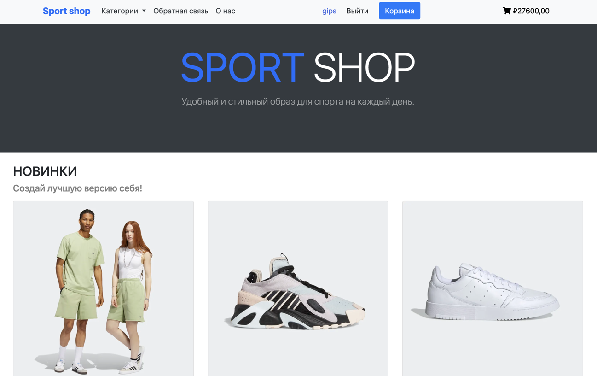
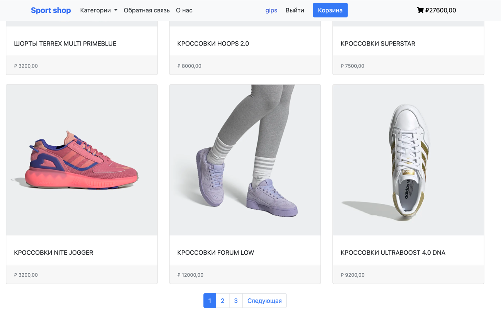
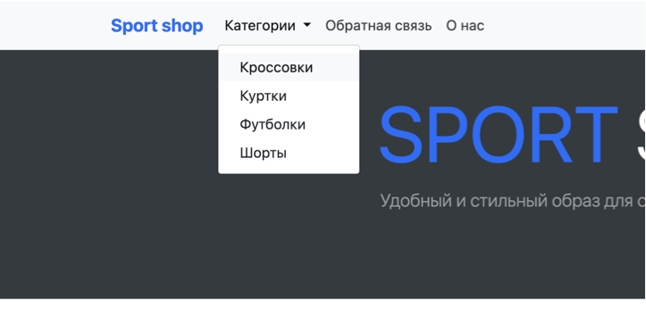
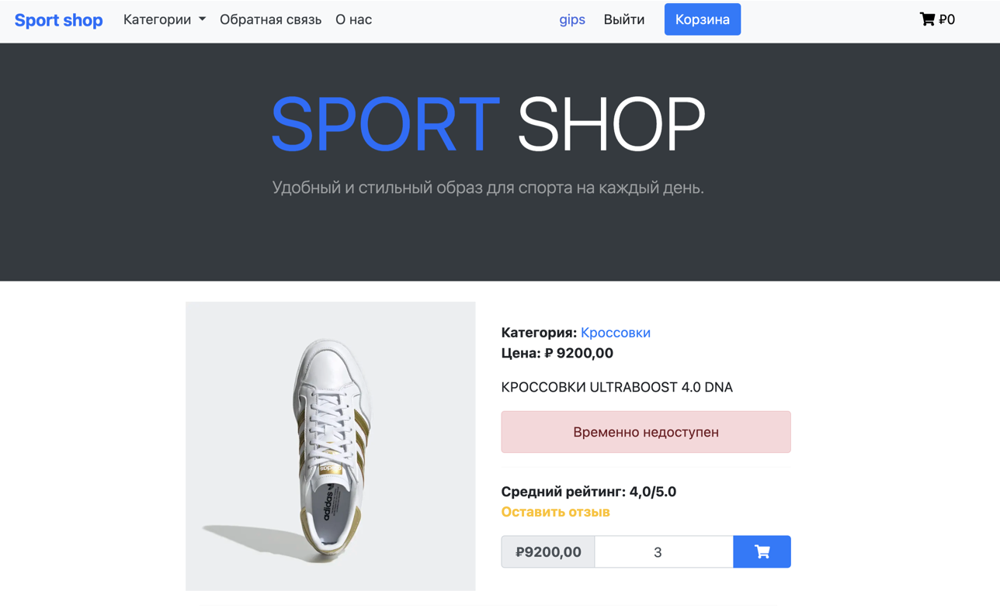
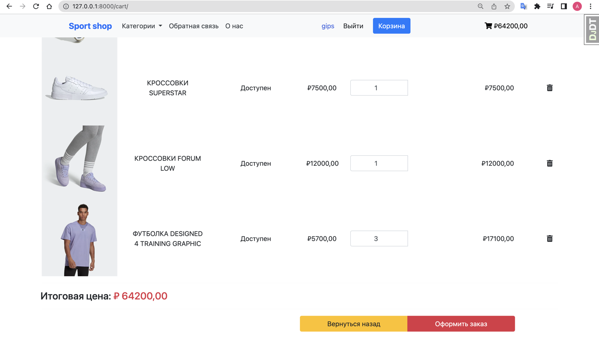
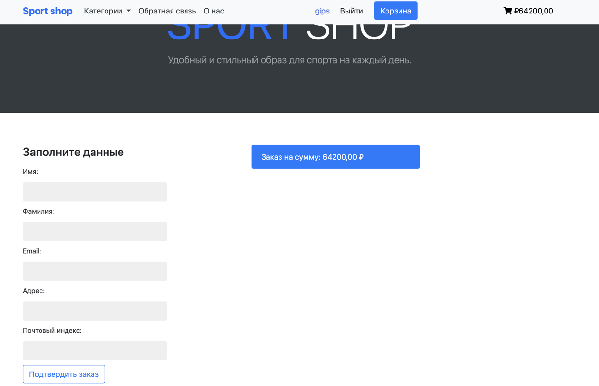
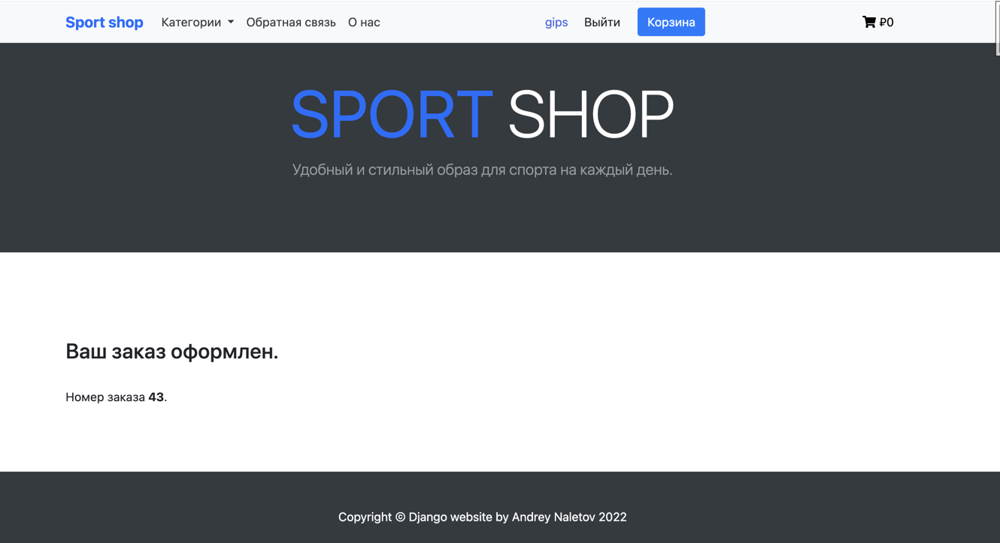
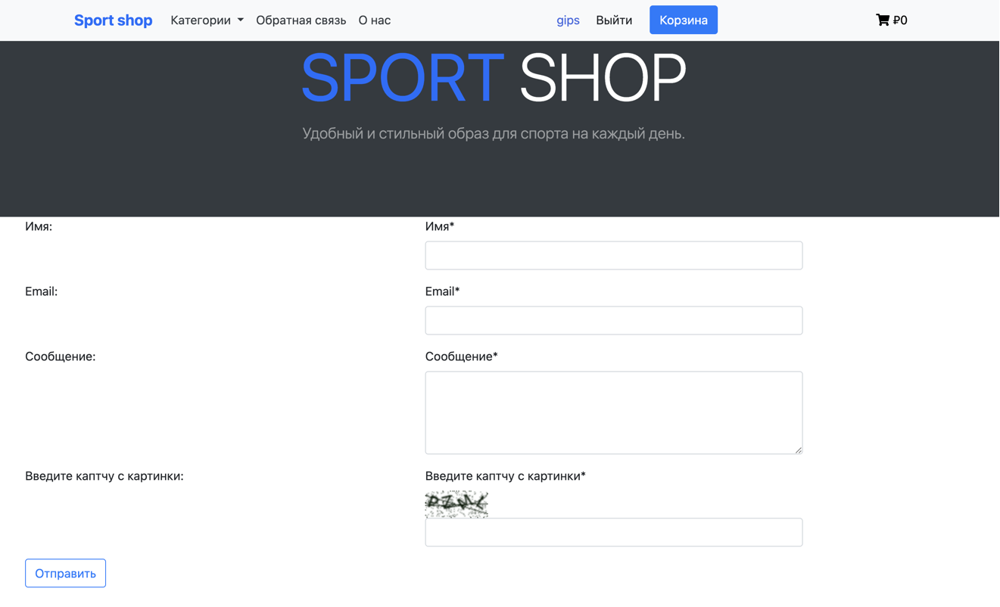

# Интернет-магазин спортивной одежды на Django

Данный проект выполнен на Django версии 4.1 с использованием Python 3.10. Фронтенд реализован с использованием Django-шаблонов, HTML, CSS, а некоторые блоки были выполнены с использованием Bootstrap. База данных - SQLite.

## Функционал

### Приложения:

1) #### SHOP: 
- список товаров;
- категории;
- возможность оставить отзыв;
- рейтинговая систем;
- личный кабинет (регистрация, аутентификация).






2) #### CART:
- возможность добавлять и удалять товары в корзине;
- расчет стоимости.



3) #### ORDERS:
- возможность оформить заказ с тестовой отправкой заказа на e-mail;
- отображение заказов в админке.



### Дополнительно реализовано: 
- админ-панель с возможностью загружать и настраивать товары (включая фото) и категории;
- отображение миниатюр для товаров;
- Django Debug Toolbar (оптимизация части запросов-удалены дубли для ленивых запросов);
- кэширование;
- форма обратной связи.

## Установка

1) Установите Python 3.10 и виртуальное окружение (virtualenv), если еще не установлены.
2) Устанавливаем зависимости: ``` pip install -r requirements.txt ```
3) Переходим в папку с проектом: ``` cd django_shop ```
4) Далее запускаем сервер командой: ``` python manage.py runserver ```


## Автор

* **Andrey Naletov. 2022**

